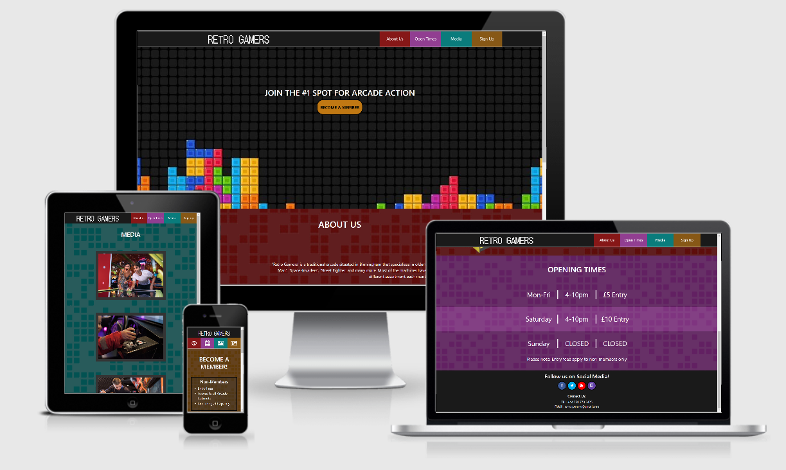
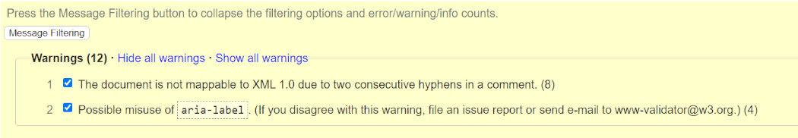
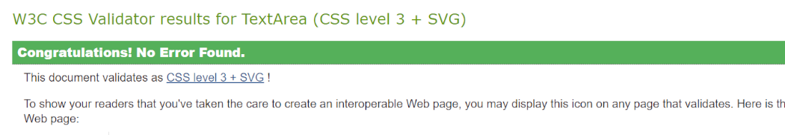
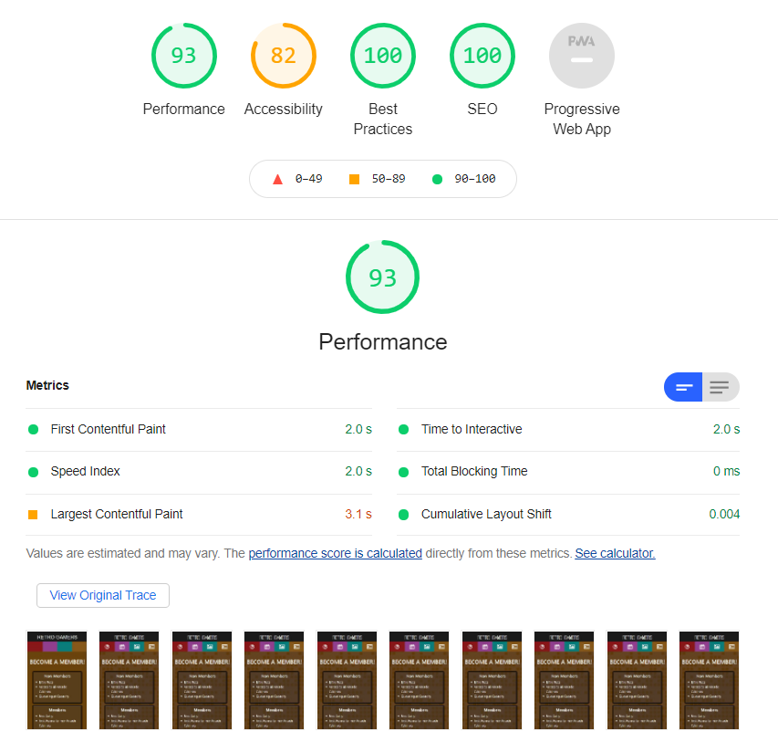

 
# Retro Gamers
## A User Centric Milestone Project by Edward Stanley
This website is for a fictional gaming entertainment venue that specialises in upright arcade machines such as the classic 'Pac-Man' or 'Destroyer' games. The specific selling point to the user is the niche of being able to play these arcade games since a single cabinet can sell for thousands. The user is able to learn about the company, find out opening times, view different media sources, and ultimatley sign up to become a member.
#
## UX
## Different User objectives
### Owners business objectives
* The owner can use the website to promote the gaming venue
* The owner can reach a larger target audience than by word of mouth
* The owner wants people to sign up for membership 
### User objectives
* The user wants to know more about the specific entertainment on display
* The user wants to see contact information for the venue
* The user would be interested in visually seeing what the place is like
* The user might be interested in other forms of media such as youtube or twitch that the company uses
* The user would want to know about the perks of being a member
* The user would want to know when the place is open
* The user would want the ability to sign up as a member

## User Stories
### As an owner:
* I want the site to be easily navigated so users can find what they want
* I want to attract users to the website with the styles used
* I want users to become members of the gaming venue
* I want users to see the latest photos and videos from the venue
* I want users to be informed about what we do, and when we are open
* I want users to be able to contact us directly with any queries etc.
### As a user:
* I want to be able to find what I am looking for
* I want to be informed on the latest fees/ opening times
* I want to be able to sign up as a member
* I want external links to open in a new tab
* I want everything to resize to my current screen

#
## Wireframes
The following wirefrane was made in Balsamiq  
[Please Click Here.](readmeassets/retrogamerswireframe.pdf)

The wireframe can also be found in the readmeassets folder included in this project

#
## Features
### Existing Features
1) The Navigation Bar - A dynamically chaning nav that swaps text for icons when the screen size is too small, links that take you to the other sections/pages, and a styalised logo 
2) The Header - An eye catching hero image with impact text and linked button immediatley stating the purpose of the website
3) The About Section - Goes into more detail explaining to the user the premise of the gaming venue
4) The Open Times Section - Dynamically informs the user which days the venue is open and the corresponing entry fee
5) The Media Section - Has imbedded images with minor animation and videos that keep the 16:9 ratio
6) The Sign-Up Section - Explains the benefits of being a member as well as a fully interative form that submits data entered by the user
7) The Footer - Contains external links to social media pages as well as contact information for the venue

### Features Left to Implement
1) A pop up map that shows the user how far from the venue they are
2) When images are clicked in the media section they enlarge for the user
3) Another page showing the rotation of current arcade cabinets and/or prices

#
## Technologies Used
- HTML5 - Allows for the website to be structured
- CSS - Allows for the website to be styalised
- [Bootstrap](https://getbootstrap.com/) - Allowed for better dynamic resizing of the nav bar and other elements
- [FontAwesome](https://fontawesome.com/) - Allowed for icons to be used for smaller buttons in the shrunken nav and Footer
- [Google Fonts](https://fonts.google.com/) - Allowed for better styalising of the logo
- [Gitpod](https://www.gitpod.io/) - The main coding platform used to create the project
- [Github](https://github.com/) - Allowed for the website to be deployed and version control
- [Gimp Studio](https://www.gimp.org/) - Allowed the creation of custom backgrounds for the project
#
## Testing
### HTML W3 Validator
 
 After running the HTML code through the validator two groups of warnings appeared. The first was in relation to my commenting throughout the code to section it however after asking my mentor there is no reason to change it.
 The second was in relation to apparent misuse with the aria-labels used in the footer to specify external links. After checking I deemed it better to be left in to help with screen readers and warn before travelling to external sites.
 As there were no other problems with the code I would say it passed.
 ### CSS W3 Validator
 
 After running the css code through the validator no problems or warnings came up therefore it passed.
### Lighthouse Testing

After running it through Google Chrome's lighthouse tool no large issues appeared giving the website an overal performance of 93% hence showing it is well optimised.

### Larger issues through Testing
There were a few main problems I had with certain sections during the code which I would like to highlight. 
#### Issues with the nav bar overlapping
A large issue with having a fixed top navbar is due to overlap with other elements. In particular as my navbar changes height depending on the viewport width, the about us and opening times sections often got partially overlayed when their links were clicked in the nav.

To solve this I came up with moving the point the link jumps to above the actual section by adding a div offset using ```position: relative; top: -60px;```. In order to solve the changing height I used a media override to change the 60px to 120px encompassing the whole nav.

#### Issues with imbedding videos
I initially attempted to set up an iframe myself using what was learnt from the HTML module and whilst the frame worked it wouldnt connect to youtube despite having the website link.
This was the first time I had to look up external code (as stated in the code and credits). 

The result was whilst it was mostly correct, the links to youtube websites and the links to embed youtube videos are slightly different. After changing the link it worked perfectly.

### User Story Testing
##### *" Owner - I want the site to be easily navigated so users can find what they want -"*
##### *" User- I want to be able to find what I am looking for"*
- All internal navigation links work as intended, each one takes you to the top of each section with no overlap from the nav.

##### *" User- I want external links to open in a new tab"*
- All external links in the footer go to their desired location, they open a new tab.

##### *" Owner - I want users to become members of the gaming venue"*
##### *" User- I want to be able to sign up as a member"*
- The user is able to only select 1 radio input as intended. 
- All text inputs can be typed in.
- The email input requires an '@' to submit.
- If a required form element is unfilled and the submit button clicked, the form will send a notification to the user. This does not occur for the non required areas (Address line 2 and Telephone).
- If the form is filled correctly and the submit button is clicked, the form will 'POST' the data sending across all the names and values as intended.
- If the form is filled and the reset button is clicked, the form will empty itself.

##### *" User- I want to be informed on the latest fees/ opening times"*
- The open times section is fully responsive.
- The section includes a slight highlight to help differentiate between dates

##### *" Owner - I want users to see the latest photos and videos from the venue"*
- The media section is fully responsive.
- Videos keep their aspect ratio while resizing to suit the viewport.

##### *" Owner - I want users to be able to contact us directly with any queries etc."*
- The contact information is visible in the footer no matter the viewport.

##### *" User- I want everything to resize to my current screen"*
- Testing on [Am I Responsive?](http://ami.responsivedesign.is/) still allows a clean layout for different viewports.

##### *" Owner - I want to attract users to the website with the styles used"*
- The use of the 'tetris' hero image immediatley targets the intended demographic and gaming hobbyists.
- The contrast between color and background makes text easy to read.
- The darker color palette makes it easier on the eyes for the user.
- The patterned background doesn't distract from the foreground.

#
## Deployment
The project was deployed to Github Pages.
To do this I used the following steps:

1) I logged into my Github
2) I selected my repository mislestone-one-retrogaming
3) I clicked settings and scrolled to the Github pages section
4) I set the source to master branch using the dropdown menu, the page refreshed
5) I could now scroll down again to the Github pages section and get the deployment link

### How to run the project locally
1) Log into your Github
2) Follow [this link](https://github.com/SpudStar/milestone-one-retrogaming) to the repository 
3) Click the 'Code' dropdown
4) Click HTTPS and click the clipboard icon to copy the url
5) Open git bash and change the directory to where you want the cloned directory
6) Type 'git clone' and paste the url  
7) Press enter to create a clone
#
## Credits
### External Code
There are two pieces of code I used from external sources as mentioned in my code comments:

The first is the iframe for the youtube videos which naturally has an embed function, I edited some of the values after to suit my purposes

The second is from a site teaching me about the 'tel' form input type which can be found [here](https://developer.mozilla.org/en-US/docs/Web/HTML/Element/input/tel)

### Media - videos
Two arcade specific videos are embeded in the media.html file.

The first is a Pac-Man completion run by user 'Jamey Pittman' which can be found [here](https://www.youtube.com/watch?v=AuoH0vz3Mqk)

The second is a Donkey Kong completion run by user 'Carls493' which can be found [here](https://www.youtube.com/watch?v=Pp2aMs38ERY)

### Media - photos
Ten photos were used in total throughout the project.

stockimage1, stockimage2, stockimage3, and stockimage4 were all obtained from Abode Stock, the specific search can be found [here](https://stock.adobe.com/uk/search?load_type=search&native_visual_search=&similar_content_id=&is_recent_search=1&search_type=recentsearch&k=arcade+people)

mediasection, opensection, aboutsection, and signupsection were all made by me using Gimp software

hero-image-tetris was obtained from wallpaper cave, the specific image can be found [here](https://wallpapercave.com/tetris-wallpaper)

arcade-cabinet.png was obtained from Arcade Direct a site that sells arcade cabinets, the specific image can be found [here](https://arcadedirect.co.uk/original-pacman-arcade-machine/)

## Acknowledgement
I would like to thank my mentor for preparing me for what I would need for my first project

#
Thank you for reading.
#